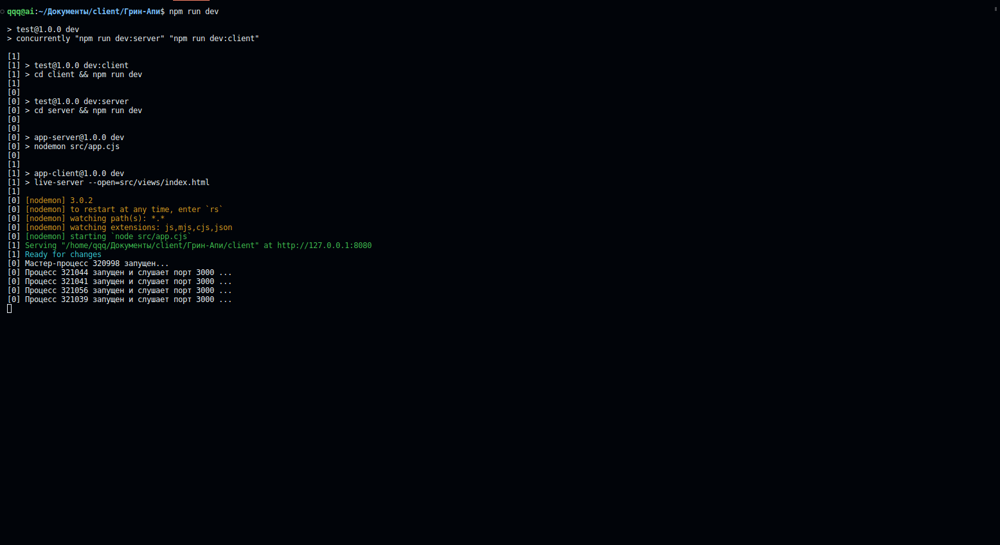
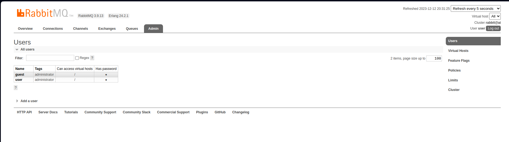

# Client-Server web application with nodeJS(express) using RabbitMQ to accept requests one by one asynchronously.

## Инструкция по развёртыванию локально:
### Установить rabbitMQ
#### - заменить значения на ваш user:password в файле server/src/config/rabbitMQ.config.cjs
### Установить nodejs с npm
### Команды для установки зависимостей и запуска приложения
#### - npm install
#### - npm run dev
##### (приложение протестировано на Ubuntu 22.04.3 LTS, кроссплатформенный запуск не учитывался)

## Concurrently RUN example

## CLIENT

## RESULT

## RABBITMQ - example new user with opened auth
